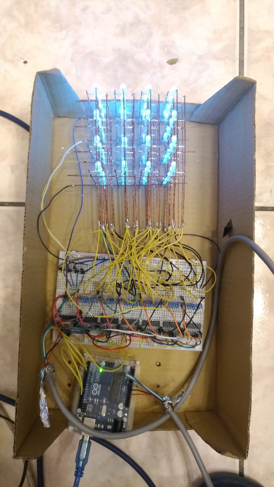

# 4x4x4 RGB LED 立方
## 簡介
有點忘了當初為什麼會起心動念想做這玩意兒，反正自己的個性就是常常沒事找事做，尤其最喜歡做一些華而不實的東西。整個作品其實大部分是參考這部影片[How to make 4x4x4 RGB led cube using Arduino](https://www.youtube.com/watch?v=t2ld4nQV0Dc&t=1470s)。其實只要搜尋 "LED cube" 就會有一大堆相關的教學，這部影片的步驟描述還蠻清楚的，材料有詳細列出，也在github附上[source code和電路圖](https://github.com/anoopmm/RGB_LED_CUBE)，所以最後我選擇信他一把，照著上面的教學自己去買材料來玩看看。雖然做的東西基本上大同小異，但我在整個製作的過程中發現似乎蠻少中文部落格有清楚的講解如何製作LED立方，因此我還是決定儘可能記錄每個步驟，為其他~~遊手好閒~~的同好們分享完整的製作過程。

先來看看成品


> 以Arduino版作為控制器，並使用IDE內建的 _SPI(Serial Peripheral Interface)_ library搭配數個 _595 IC_ 來達到以有限的硬體同時控制多個pin腳(x52)的需求，也就是所謂"串入並出(_series in parallel out_)"。並可以透過更改軟體，重新寫入Arduino版，將整個LED立方的閃爍模式改變。

## 材料
* Arduino Nano or Uno
* USB傳輸線
* 74HC595 IC x7
* 電阻
    * 330 Ω x48
    * 1k  Ω x5
    * 10k Ω x2
* 電晶體 2n2222 x4
* PCB洞洞板
* 銅線(約9m)
* RGB LED(common cathode共陰，霧面為佳) x64
* 壓克力or玻璃罩(12\*12\*12 cm)
* 紙盒(需要一定硬度)or木盒(13.8\*13.8\*10.2)
* 3P搖頭開關
* LED平頭按鈕
* 焊錫線 & 電烙鐵
* 電線(絞線為佳)及杜邦線數條(測試用)
* 紙箱及厚紙板

##　流程
#### 步驟一: LED骨架
第一步，先進行LED及銅線骨架的焊接。這是攸關成品外觀美醜的一步，需要相當的耐心及細心。首先需要將所有LED先過電測試一遍，確認RGB三色都能正常運作，記得加上電阻避免負載過大將LED燒毀。

講到這裡我不得不先吐槽一下，網路上這麼多影片和介紹，我卻都沒看到有人提到銅線到底要去哪買。聽起來似乎不是什麼大問題，但實際上我真的跑了好幾家電子材料店和五金行才找到適合的銅線(之前有試過鐵絲，但不知道為啥吃不了錫就放棄了)。後來我在 _自助家DIY居家生活中心_ 找到**7芯建築線**，價錢雖然忘了但應該蠻便宜的，而且一條可以剝出7條銅芯線來使用，軟硬度野蠻剛好的。如果銅線彎掉了可以拿電鑽固定一頭，另一頭拿夾子或老虎鉗固定，然後開啟電鑽慢慢轉。注意轉速不要太快，否則可能有斷裂的風險，只要看到差不多夠直，或者開始聽到銅線發出哀號聲，就可以停下來了。這個方法還蠻有趣的，還會因為旋轉擠壓增加銅線的硬度(不過也會稍微變短就是了)。


接著在焊接之前，需要先了解LED立方的電路結構。可以將其視為16根LED柱，每根柱子有4顆LED，同一個高度的LED的接地端都是連接在一起的。有點類似設定三軸座標的概念，可以用`xyz`三個參數定義LED的位置。先用`x`和`y`選出16根柱子的其中一根，再透過`z`決定該LED柱的其中一顆LED。
由於使用的是RGB LED有四根pin腳，將其分別以90度折向四方，並把代表RGB的三個pin腳經由銅線焊接在一起，並保留接地的pin腳(可以順便先上點錫方便之後使用)。

至於要如何焊接出一根根整齊的LED柱呢?這個時候就需要借助一些厚紙板，我將LED之間的間距設定在2.5cm，焊點與LED中心的距離設定為0.9cm。根據以上的間距需求裁減適當的紙板大小，組合出一個方便進行焊接作業的模具(**模具的精準度決定了之後的成品是否工整!!!**)。如圖:


朝向最下方的黑線是用來對齊接地端的pin腳，其餘三個方向就各用一條銅線連接起來。

完成的LED柱:


焊完16根LED柱，你就會慶幸自己不是做5x5x5或其大更大size的的cube了XD。接下來，我們需要以4根柱子為一單位，組出四面LED牆。在那之前會需要用一個到厚度不會太厚的紙箱，以2.5cm為間距畫出一個9宮格(不小心畫成16)，並在每個交點戳出可以剛好塞入LED頭部的洞。


依序將16根LED柱插上，建議拿幾個夾子固定住，確保每個柱子之間是對齊的狀態。


接下來，每一面LED牆都需要4根銅線把每一層LED的接地端連接起來，多餘的LED pin腳可以先剪掉，避免干擾之後作業。


完成四面LED牆之後，最後就是把他們組合成LED立方了!理論上只需要4根銅線，連接每一層的LED接地網路就行了。但為了讓立方的結構能更穩定一些，如果空間允許的話(如果前面的步驟都焊的歪歪斜斜的話可能就不太允許XD)，我建議每層都分別用兩根銅線固定。


完成了上半部的LED立方結構!接下來就是電路的部分了。

#### 步驟二: 驅動電路
我在這一步的時候是先接到麵包版上測試，確定軟、硬體都能正常運作後，再將元件焊到洞洞板上。要不要先進行測試看妳各位對自己的電路知識有沒有信心囉XD。



看起來很複雜，但其實就是7組一樣的電路串接在一起而已。

基本上就是按[電路圖](https://github.com/anoopmm/RGB_LED_CUBE/blob/master/rgbled.PDF)施工，**注意整個電路的長寬將裁減後必須小於之後要安裝在裡面的盒子**，所以就儘量不要浪費空間囉。另外，我也建議各位在洞洞板上使用可以自由插拔的排線，不然像我一樣直接焊死在上面最後與LED立方焊接的時候會非常麻煩。還有電線要記得預留長度，免得之後太短焊不上就尷尬了。

我的元件擺放位置及佈線供大家參考。


如果是跟我一樣沒什麼焊接經驗的朋友，我可以保證做完後絕對會功力大增XD。


至於Arduino的板子要用哪一種，其實常見的`Uno`、`Nano`、`Leonardo`或是更高階的其他板子應該都可以。以這個專案來說，硬體的需求不太高，只需要支援`SPI`並有外部插斷功能的就可以了。我自己是選擇`Nano`，除了價格便宜，大小也比較不占空間，而且有排針可以直接固定在洞洞板上非常方便。

順帶一提，除了原本的電路以外，因為覺得沒有任何機械式的按鈕很怪，我有額外追加開關，電源顯示跟跳脫按鈕的功能。只要一插上電源，平頭按鈕裡的LED就會亮起代表供電正常。接著只要將開關切到`on`，整個LED立方就會開始運作。至於按鈕則是可以根據使用需求調整功能，我特意將他連接到支援**外部中斷**(_external interrupt_)的pin腳(可以參考[Arduino 官網](https://www.arduino.cc/reference/en/language/functions/external-interrupts/attachinterrupt/)的說明)，並設計一個下拉(_pull down_)電阻外加去彈跳(_debounce_)電容，完成一個簡單的[RC電路](https://reference.digilentinc.com/learn/microprocessor/tutorials/debouncing-via-rc-filter/start)，方便我們以硬體的方式快速切換LED的模式。相關電路圖如下:


差點忘了，因為我希望接上電源時Arduino版不會立刻啟動，而是要透過開關過電後再運作。所以我會另外拿一條USB線，保留type-A那端，把另外一頭剪下並撥線。因為不用傳輸資料，只拿紅黑兩股線就好(接上手機變壓器就有5V的電源)，黑線連到Arduino的`GND`，紅線則接上搖頭開關的共接點。開關ON的那一側再接上`Arduino 5V`的腳位。注意電路圖中的`5V`和`Arduino 5V`這兩個腳位並不是完全相通，中間還有經過搖頭開關的控制。其實之前好像有看到網路上有文章說最好把供電接到Arduino `Vin` 這個腳位而不是 `5V`。雖然都能運作，但`Vin`這個腳位有做穩壓保護會比較安全一些。但我已經做完整個作品才知道這件事，就懶得改了XD，還沒做的各位記得改一下啊。

#### 步驟三: 軟體及測試
至於程式碼的部分嘛...，我是直接拿現成的修改，註解也蠻完整的，大家就自己心領神會一下吧XD。反正主要就是透過`LED(int row, int column, int level, byte red, byte green, byte blue)`這個function來控制給定位置LED的亮度，至於更底層與`SPI`相關的東西，我也沒有了解的很透徹。不過如果只是要自己設計出喜歡的LED閃爍模式的話，其實只需要會用剛剛提到的`LED()` function，還有`millis()`、`delay()`等等跟時間延遲有關的功能就可以玩出不少花樣了。我自己有寫一個`rain()`模式，讓LED立方產生像是下雨的視覺效果，看著看著其實還蠻療癒的哈哈。
順帶一提，為了實現前面所講的硬體中斷，我也另外再設定一個`jump`訊號。一旦中斷觸發(因為是下拉電阻，所以使用`RISING`抓取上升訊號的瞬間)，就將`jump`設為`true`。在每個不同的閃爍模式中，我都有額外加入以下判斷式:
```c
if(jump){
    jump=false;
    clean();
    return;  
}
```
意即將`jump`訊號reset、LED全部設為初始狀態後，並直接結束function。由於arduino的main function本身是個無窮迴圈，所以就會自然跳到下一個模式了。
寫完軟體後，就燒錄到arduino版測試看看，確認運作的方式跟是否自己所想的一致。測試無誤後，建議可以把每個銅線及對應的電線做個記號，省的之後重新組裝還要擔心會不會接錯。

#### 步驟四: 組裝
終於到了最後的步驟了!確認所有功能都能正常運作後，接下來就剩下把醜醜的電線藏在盒子裡了。我可以提供我選用的盒子[USE ME 1號鐵片禮物盒(黑)](https://www.kingstone.com.tw/basic/2082290789153/)給大家參考，網路上或實體書局都有在販賣(講的好像在業配XD)。選紙盒的好處在於鑽孔方便(有52個孔要鑽...):

(鑽完才發現骨架有多歪...)

只是要注意紙盒的強度要能夠支撐整個LED立方，而且選用這類單一開口的紙盒**絕對不要選太小**，否則最後將電線焊上去的時候你會非常崩潰，之後的維護也會很麻煩。我選的這個大小其實已經很極限了，最後幾根電線真的喬了很久才焊上去，電烙鐵還差點把其他線融掉。

焊接地獄...空間非常狹小，焊到後面真的只能隨便黏一下XD。


如果覺得接合點不太牢固就擠點白膠給它


因為LED立方本身還是挺脆弱的，而且我有點擔心可能會被外在的一些導體意外造成短路，所以還是買了一個壓克力的遮罩給它。就直接拿白膠黏上去了，最好不要黏太牢，因為如果之後LED燒壞了還得拆下來更換(萬一壞的是核心那8顆LED就很慘了...)。

完成


